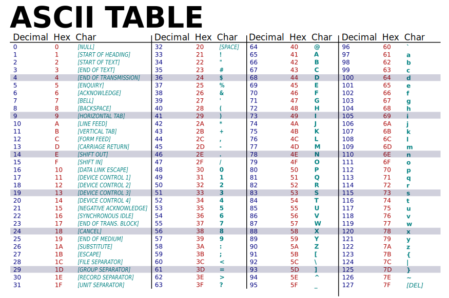

# ssh-testing

This repo is purely made for documenting me poking around at the raw TCP packets durring the SSH handshake.
Hopefully I end up writing 'Hello World' to the screen when ssh-ing into the server.

After getting a prototype in JS, I would probably try to implement the code in a lower-level language like zig, c++ or rust.

Sources:
- [OpenSSH Spcifications](https://www.openssh.com/specs.html)
- [RFC4254: The Secure Shell (SSH) Connection Protocol](https://datatracker.ietf.org/doc/html/rfc4254)
- [RFC4253: The Secure Shell (SSH) Transport Layer Protocol](https://datatracker.ietf.org/doc/html/rfc4253)
- [RFC4250: The Secure Shell (SSH) Protocol Assigned Numbers](https://datatracker.ietf.org/doc/html/rfc4250)
- [RFC4251:  The Secure Shell (SSH) Protocol Architecture](https://datatracker.ietf.org/doc/html/rfc4251)

ASCII Table Refrence
